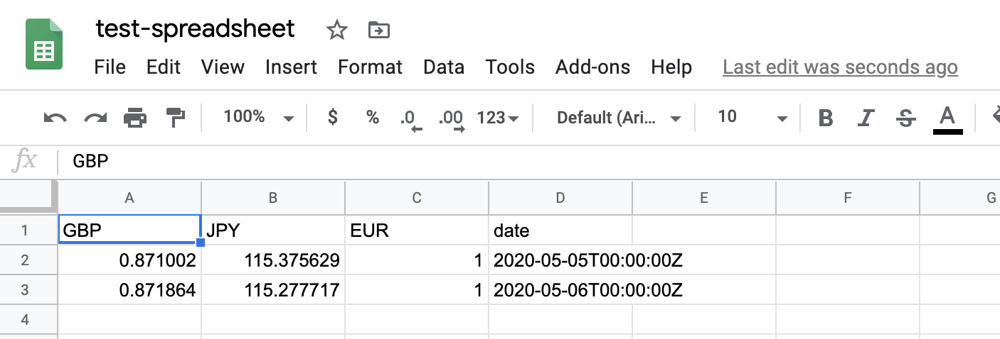
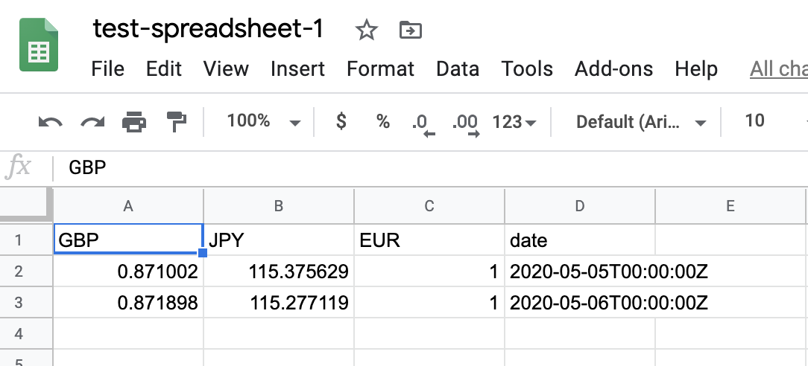
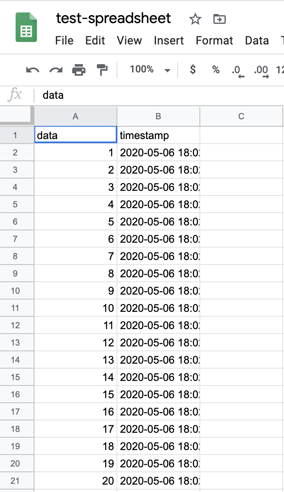
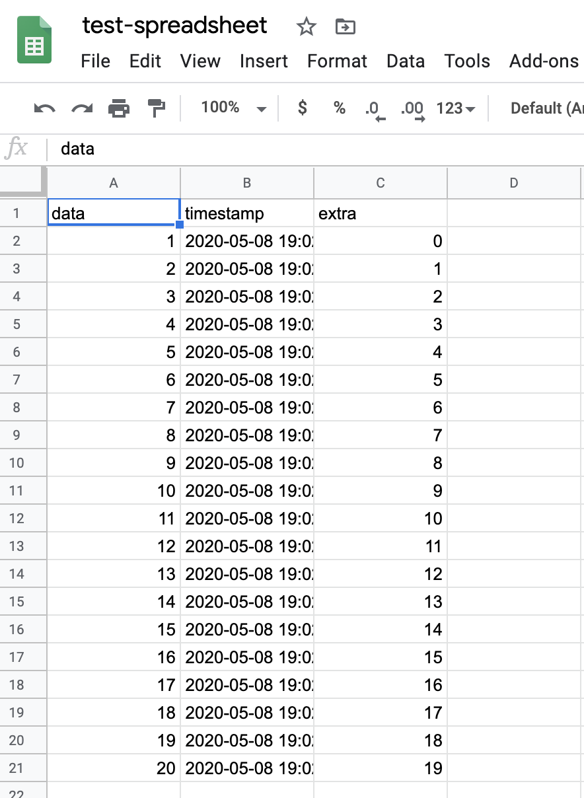
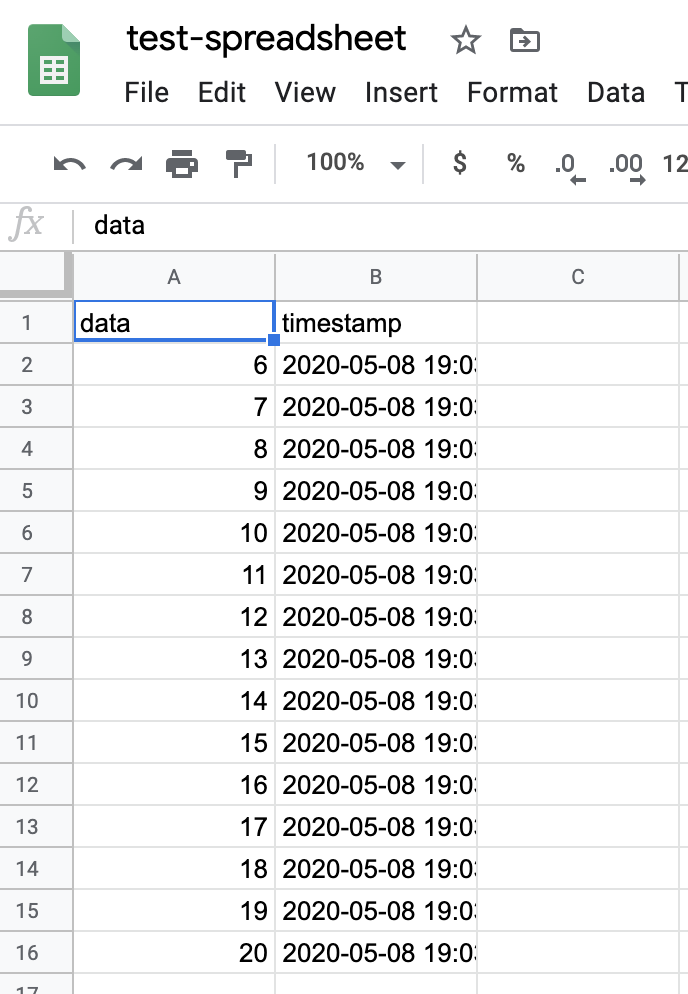
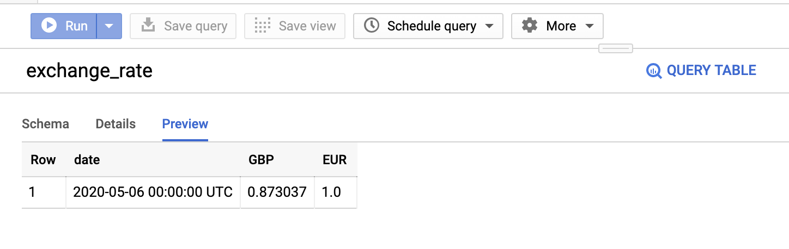

<p align="center">
    <a href="#readme">
        
    </a>
</p>

---

**dynamic-singer**, Python API, Dynamic source, N targets, Prometheus exporter, realtime transformation for Singer ETL

This library is an extension for singer.io for easier deployment, metrics, auto-detect schema, realtime transformation and sinking to multiple targets. Read more about singer.io at https://www.singer.io/.

**dynamic-singer** also able to run in Jupyter Notebook.

## Table of contents

  * [Installing from the PyPI](#Installing-from-the-PyPI)
  * [How-to](#how-to)
    * [Run using Python](#run-using-python)
    * [Prometheus exporter](#Prometheus-exporter)
    * [N targets](#N-targets)
    * [Tap Python object](#Tap-Python-object)
      * [Rules if we use an object](#Rules-if-we-use-an-object)
    * [Target Python object](#Target-Python-object)
      * [Rules if we use an object](#rules-if-we-use-an-object-1)
    * [Realtime Transformation](#Realtime-Transformation)
      * [Add new keys](#Add-new-keys)
      * [Filter rows based on conditions](#Filter-rows-based-on-conditions)
  * [Example](#Example)
  * [Usage](#Usage)
    * [dynamic_singer.Source](#dynamic_singerSource)
      * [dynamic_singer.Source.add](#dynamic_singerSourceadd)
      * [dynamic_singer.Source.get_targets](#dynamic_singerSourceget_targets)
      * [dynamic_singer.Source.delete_target](#dynamic_singerSourcedelete_target)
      * [dynamic_singer.Source.start](#dynamic_singerSourcestart)

## Installing from the PyPI

```bash
pip install dynamic-singer
```

## How-to

### Run using Python

If you are familiar with singer, we know to start sourcing from Tap to Target required Bash `|` command, example,

```bash
tap-fixerio --config fixerio-config.json | target-gsheet --config gsheet-config.json
```

For dynamic-singer, you can run this using Python interface,

```python
import dynamic_singer as dsinger
source = dsinger.Source('tap-fixerio --config fixerio-config.json')
source.add('target-gsheet --config gsheet-config.json')
source.start()
```

Check google spreadsheet here, [link](https://docs.google.com/spreadsheets/d/1fH7C2KCi3P1Uef5wNv8-f_oJlYGYat9d5e5zKxkMoOk/edit?usp=sharing)



Full example, check [example/fixerio-gsheet.ipynb](example/fixerio-gsheet.ipynb).

### Prometheus exporter

Now we want to keep track metrics from Tap and Targets, by default we cannot do it using singer because singer using Bash pipe `|`, to solve that, we need to do something like,

```bash
tap | prometheus | target | prometheus
```

But `prometheus` need to understand the pipe. And nobody got time for that. Do not worry, by default dynamic-singer already enable prometheus exporter. dynamic-singer captures,

1. output rates from tap
2. data size from tap
3. output rates from target
4. data size from target

```python
import dynamic_singer as dsinger
source = dsinger.Source('tap-fixerio --config fixerio-config.json')
source.add('target-gsheet --config gsheet-config.json')
source.start()
```

So if you go to [http://localhost:8000](http://localhost:8000),

```text
# HELP total_tap_fixerio_total total rows tap_fixerio
# TYPE total_tap_fixerio_total counter
total_tap_fixerio_total 4.0
# TYPE total_tap_fixerio_created gauge
total_tap_fixerio_created 1.5887420455044758e+09
# HELP data_size_tap_fixerio summary of data size tap_fixerio (KB)
# TYPE data_size_tap_fixerio summary
data_size_tap_fixerio_count 4.0
data_size_tap_fixerio_sum 0.738
# TYPE data_size_tap_fixerio_created gauge
data_size_tap_fixerio_created 1.588742045504552e+09

total_target_gsheet_total 4.0
# TYPE total_target_gsheet_created gauge
total_target_gsheet_created 1.588742045529744e+09
# HELP data_size_target_gsheet summary of data size target_gsheet (KB)
# TYPE data_size_target_gsheet summary
data_size_target_gsheet_count 4.0
data_size_target_gsheet_sum 0.196
# TYPE data_size_target_gsheet_created gauge
data_size_target_gsheet_created 1.5887420455298738e+09
```

Name convention simply took from tap / target name.

### N targets

Let say I want to target more than 1 targets, I want to save to 2 different spreadsheets at the same time. If singer, we need to initiate pipe twice.

```bash
tap-fixerio --config fixerio-config.json | target-gsheet --config gsheet-config1.json
```

```bash
tap-fixerio --config fixerio-config.json | target-gsheet --config gsheet-config2.json
```

If we do this, both sheets probably got different data! Oh no!

So to add more than one target using dynamic-singer,

```python
import dynamic_singer as dsinger
source = dsinger.Source('tap-fixerio --config fixerio-config.json')
source.add('target-gsheet --config gsheet-config.json')
source.add('target-gsheet --config gsheet-config1.json')
source.start()
```

Check first google spreadsheet here, [link](https://docs.google.com/spreadsheets/d/1fH7C2KCi3P1Uef5wNv8-f_oJlYGYat9d5e5zKxkMoOk/edit?usp=sharing)


Check second google spreadsheet here, [link](https://docs.google.com/spreadsheets/d/1fH7C2KCi3P1Uef5wNv8-f_oJlYGYat9d5e5zKxkMoOk/edit?usp=sharing)



Full example, check [example/fixerio-gsheet-twice.ipynb](example/fixerio-gsheet-twice.ipynb).

### Tap Python object

Now let say I want to transfer data from python code as a Tap, I need to write it like,

```bash
python3 tap.py | target-gsheet --config gsheet-config.json
```

Good thing if using dynamic-singer, you can directly transfer data from python object into Targets.

```python

import dynamic_singer as dsinger

class Example:
    def __init__(self, size):
        self.size = size
        self.count = 0
        
    def emit(self):
        if self.count < self.size:
            self.count += 1
            return {'data': self.count}


example = Example(20)
source = dsinger.Source(example, tap_name = 'example', tap_key = 'timestamp')
source.add('target-gsheet --config gsheet-config.json')
source.start()
```

Check google spreadsheet here, [link](https://docs.google.com/spreadsheets/d/1fH7C2KCi3P1Uef5wNv8-f_oJlYGYat9d5e5zKxkMoOk/edit?usp=sharing)



Full example, check [example/iterator-gsheet.ipynb](example/iterator-gsheet.ipynb).

#### Rules if we use an object

1. Must has `emit` method.

If not, it will throw an error,

```text
ValueError: tap must a string or an object with method `emit`
```

2. `emit` must returned a dict, if want to terminate, simply returned `None`.

If not, it will throw an error,

```text
ValueError: tap.emit() must returned a dict
```

3. `tap_schema` must a dict or None. If None, it will auto generate schema based on `tap.emit()`.
4. `tap_name` is necessary, this is name for the tap.
5. `tap_key` is necessary, it acted as primary key for the tap.

If `tap_key` not inside the dictionary, it will throw an error,

```text
ValueError: tap key not exist in elements from tap
```

### Target Python object

Now if we look into target provided by singer.io, example like, https://github.com/singer-io/target-gsheet, or https://github.com/RealSelf/target-bigquery, to build target is complicated and must able to parse value from terminal pipe.

But with dynamic-singer, to create a target is very simple.

Let say I want to build a target that save every row from fixer-io to a text file,

```python
import dynamic_singer as dsinger

class Target:
    def __init__(self, filename):
        self.f = open(filename, 'a')
        
    def parse(self, row):
        self.f.write(row)
        return row

target = Target('test.txt')
source = dsinger.Source('tap-fixerio --config fixer-config.json')
source.add(target)
source.start()
```

After that, check [test.txt](example/test.txt),

```text
{"type": "SCHEMA", "stream": "exchange_rate", "schema": {"type": "object", "properties": {"date": {"type": "string", "format": "date-time"}}, "additionalProperties": true}, "key_properties": ["date"]}{"type": "RECORD", "stream": "exchange_rate", "record": {"GBP": "0.871002", "JPY": "115.375629", "EUR": "1.0", "date": "2020-05-05T00:00:00Z"}}{"type": "RECORD", "stream": "exchange_rate", "record": {"GBP": "0.872634", "JPY": "114.804452", "EUR": "1.0", "date": "2020-05-06T00:00:00Z"}}{"type": "STATE", "value": {"start_date": "2020-05-06"}}
```

**Singer tap always send schema information, so remember to parse it properly**.

Full example, check [example/fixerio-writefile.ipynb](example/fixerio-writefile.ipynb).

## Realtime Transformation

When talking about transformation,

1. We want to add new values in a row.
2. Edit existing values in a row.
3. Filter rows based on certain conditions.

#### Add new keys

dynamic-singer supported realtime transformation as simple,

```python
import dynamic_singer as dsinger
from datetime import datetime

count = 0
def transformation(row):
    global count
    row['extra'] = count
    count += 1
    return row

example = Example(20)
source = dsinger.Source(example, tap_name = 'example-transformation', tap_key = 'timestamp')
source.add('target-gsheet --config gsheet-config.json')
source.start(transformation = transformation)
```

Even we added new values in the row, dynamic-singer will auto generate new schema.



Full example, check [example/iterator-transformation-gsheet.ipynb](example/iterator-transformation-gsheet.ipynb).

#### Filter rows based on conditions

```python
import dynamic_singer as dsinger
from datetime import datetime

def transformation(row):
    if row['data'] > 5:
        return row

example = Example(20)
source = dsinger.Source(example, tap_name = 'example-transformation', tap_key = 'timestamp')
source.add('target-gsheet --config gsheet-config.json')
source.start(transformation = transformation)
```



Full example, check [example/iterator-filter-gsheet.ipynb](example/iterator-filter-gsheet.ipynb).

#### Rules if we use an object

1. Must has `parse` method.

If not, it will throw an error,

```text
ValueError: target must a string or an object with method `parse`
```

## Example

1. [fixerio-gsheet.ipynb](example/fixerio-gsheet.ipynb).

Tap from fixerio and target to gsheet.

2. [fixerio-gsheet-twice.ipynb](example/fixerio-gsheet-twice.ipynb).

Tap from fixerio and target to multiple gsheets.

3. [iterator-gsheet.ipynb](example/iterator-gsheet.ipynb).

use Python object as a Tap and target to gsheet.

4. [fixerio-writefile.ipynb](example/fixerio-writefile.ipynb).

Tap from fixerio and save to file using Python object as a Target.

5. [fixerio-gsheet-writefile-bq.ipynb](example/fixerio-gsheet-writefile-bq.ipynb)

Tap from fixerio and save to gsheet, save to file using Python object as a Target and save to bigquery.



6. [iterator-transformation-gsheet.ipynb](example/iterator-transformation-gsheet.ipynb)

use Python object as a Tap, transform realtime and target to gsheet.

7. [iterator-filter-gsheet.ipynb](example/iterator-filter-gsheet.ipynb)

use Python object as a Tap, filter realtime and target to gsheet.


## Usage

### dynamic_singer.Source

```python
class Source:
    def __init__(
        self,
        tap,
        tap_schema: Dict = None,
        tap_name: str = None,
        tap_key: str = None,
        port: int = 8000,
    ):
        """
        Parameters
        ----------
        tap: str / object
            tap source.
        tap_schema: Dict, (default=None)
            data schema if tap an object. If `tap_schema` is None, it will auto generate schema.
        tap_name: str, (default=None)
            name for tap, necessary if tap is an object. it will throw an error if not a string if tap is an object.
        tap_key: str, (default=None)
            important non-duplicate key from `tap.emit()`, usually a timestamp.
        port: int, (default=8000)
            prometheus exporter port.
        """
```

#### dynamic_singer.Source.add

```python
def add(self, target):
    """
    Parameters
    ----------
    target: str / object
        target source.
    """
```

#### dynamic_singer.Source.get_targets

```python
def get_targets(self):
    """
    Returns
    ----------
    result: list of targets
    """
```

#### dynamic_singer.Source.delete_target

```python
def delete_target(self, index: int):
    """
    Parameters
    ----------
    index: int
        target index from `get_targets()`.
    """
```

#### dynamic_singer.Source.start

```python
def start(
        self,
        transformation: Callable = None,
        asynchronous: bool = False,
        debug: bool = True,
    ):
    """
    Parameters
    ----------
    transformation: Callable, (default=None)
        a callable variable to transform tap data, this will auto generate new data schema.
    debug: bool, (default=True)
        If True, will print every rows emitted and parsed.
    asynchronous: bool, (default=False)
        If True, emit to targets in async manner, else, loop from first target until last target.
    """
```